#  String Calculator TDD - Kata

A clean and extensible **String Calculator** built using **Test-Driven Development (TDD)** in Java.  
Supports addition of both **integers** and **decimal numbers**, with robust delimiter handling, validation, and tracking.

## 📦 Technologies

- Java 17+
- JUnit 5
- Maven (optional for build/testing)
- Follows **TDD** best practices

## ✨ NEW: Decimal Addition Support

The project now includes a separate class to handle **floating-point (double)** numbers in the same flexible way as integers.


## 🚀 Features

- ✅ Add 0, 1, or more numbers
- ✅ **Supports Integer & Decimal Addition**
- ✅ Comma `,` and newline `\n` as default delimiters
- ✅ Custom delimiters:  
  `//[delimiter]\n[numbers]` → `//;\n1;2`
- ✅ Delimiters of any length:  
  `//[***]\n1***2***3`
- ✅ Multiple delimiters supported:  
  `//[*][%]\n1*2%3`
- ✅ Multiple delimiters with length > 1:  
  `//[**][%%]\n1**2%%3`
- ✅ Ignores numbers > 1000
- ✅ Throws exception on **negative numbers**
- ✅ Tracks how many times `add()` was called

### ✅ Class: `DecimalStringCalculator`

Supports:

- Comma, newline, and custom delimiters
- Multi-character and multiple delimiters
- Negative decimal number validation
- Ignores numbers > 1000

## 📁 Project Structure

```bash
string-calculator/
├── src/
│   ├── main/
│   │   └── java/
│   │       └── com/
│   │           └── incubyte/
│   │               └── stringcalculator/
│   │                   ├── StringCalculator.java
│   │                   ├── DecimalStringCalculator.java
│   │                   └── NegativeNumberNotAllowedException.java
│   └── test/
│       └── java/
│           └── com/
│               └── incubyte/
│                   └── stringcalculator/
│                       ├── StringCalculatorTest.java
│                       └── DecimalStringCalculatorTest.java
├── pom.xml
└── README.md
```
## 💻 How to Clone & Run the Project

### 🔹 Clone the Repository

```bash
git clone https://github.com/chintanlad/stringCalculator.git
cd string-calculator
```


## 🧪 Test Case

| ID   | Description                               | Input                         | Expected Output          | ✅ Pass Image                                   | ❌ Fail Image                                   |
|------|-------------------------------------------|-------------------------------|---------------------------|------------------------------------------------|------------------------------------------------|
| TC01 | Empty input returns 0                     | `""`                          | `0` / `0.0`              |          | 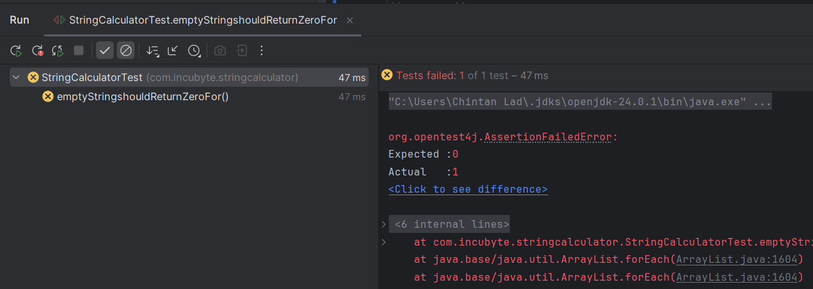         |
| TC02 | Single number returns the number itself   | `"5"` / `"2.5"`               | `5` / `2.5`              | 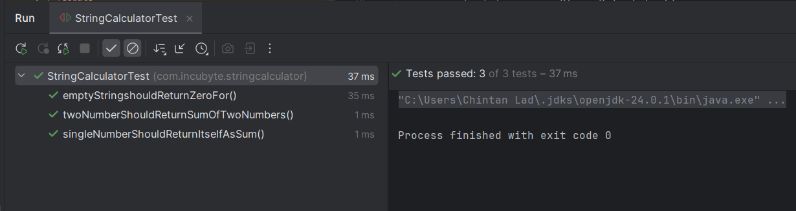         | 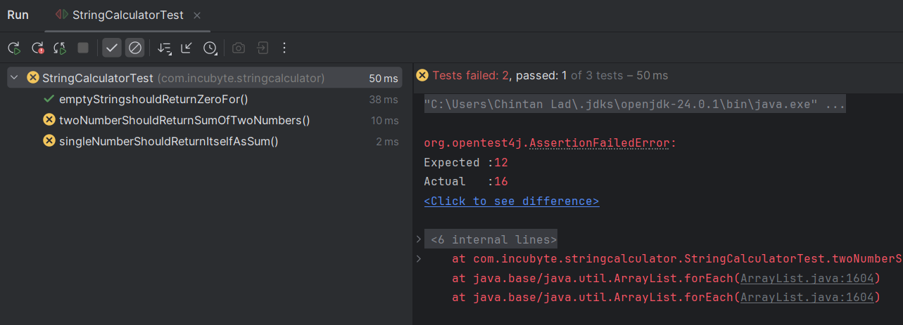         |
| TC03 | Sum of multiple comma-separated numbers   | `"1,2,3"`                     | `6`                      | 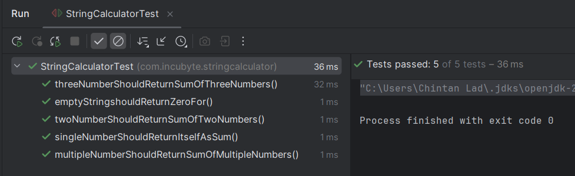         |          |
| TC04 | Handles newline as a delimiter            | `"1\n2,3"`                    | `6`                      | 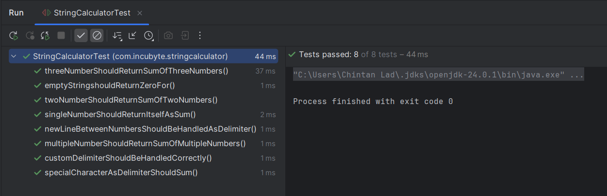         | 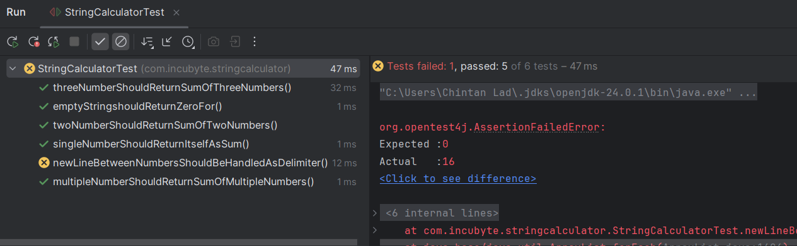         |
| TC05 | Supports custom delimiter                 | `"//;\n1;2"`                  | `3`                      | 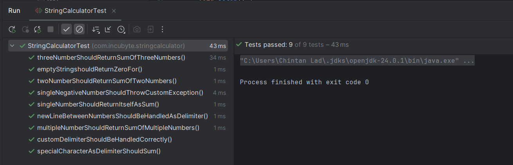         | 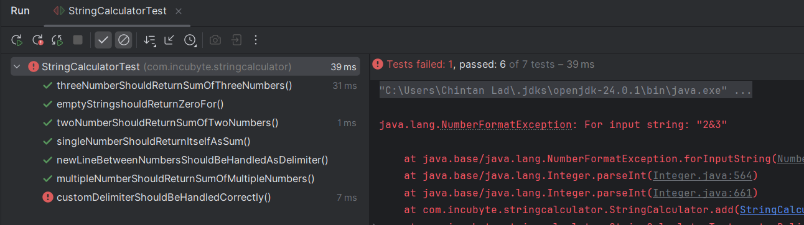         |
| TC06 | Decimal support with custom delimiter     | `"//;\n1.5;2.5"`              | `4.0`                    |         |         |
| TC07 | Throws exception for negative numbers     | `"2,-4"`                      | `Exception: -4`          | 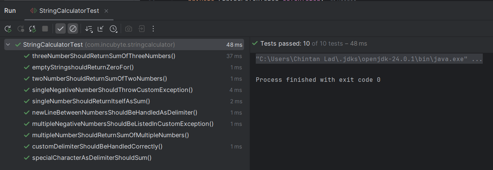         | 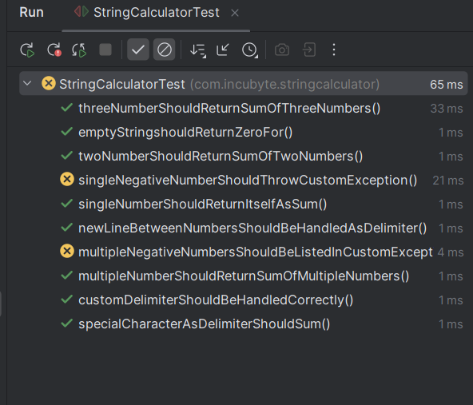         |
| TC08 | Ignores numbers > 1000                    | `"2,1001"`                    | `2`                      | 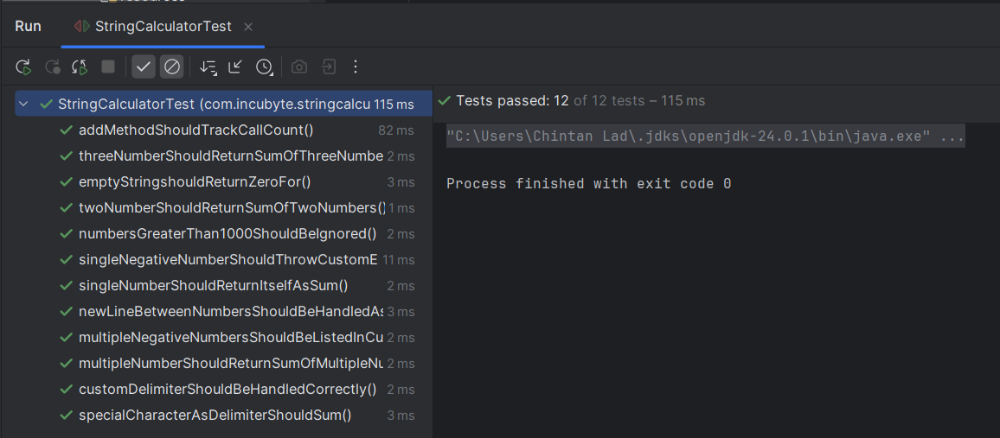         | No Fail Case       |
| TC09 | Tracks method call count                  | Multiple `add()` calls        | `Count = N`              | 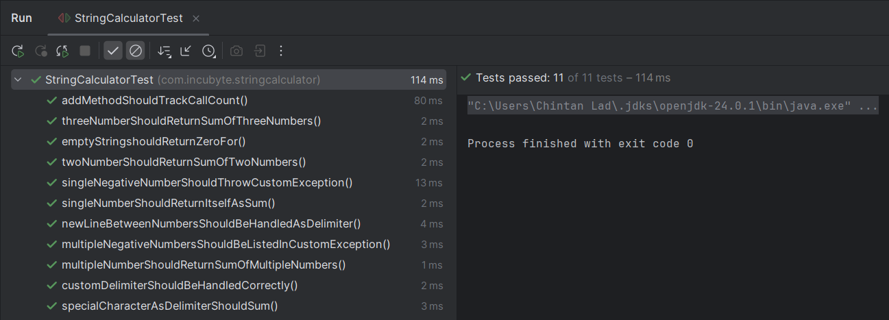        | 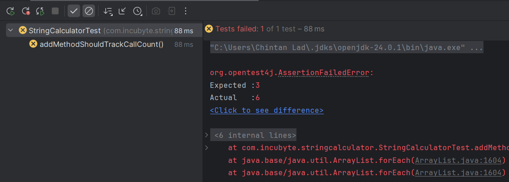        |
| TC10 | Custom multi-character delimiters         | `"//[***]\n1***2***3"`        | `6`                      | 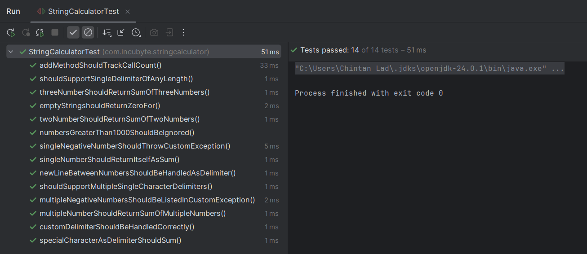         | 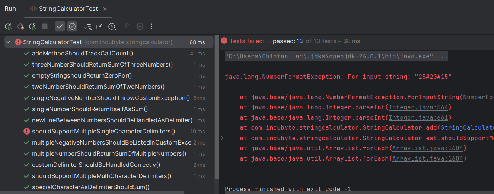         |
| TC11 | Supports multiple delimiters              | `"//[*][%]\n1*2%3"`           | `6`                      | 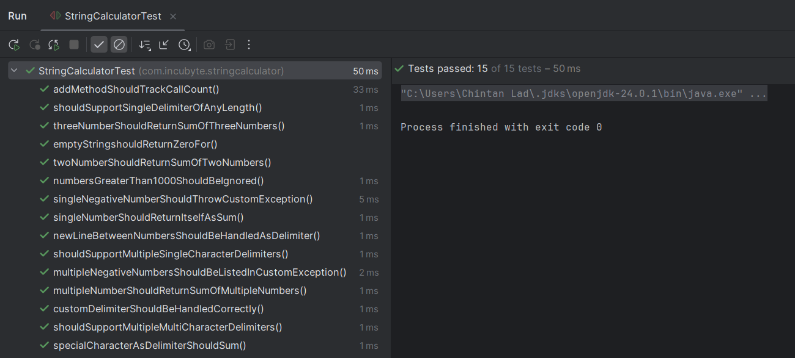         | 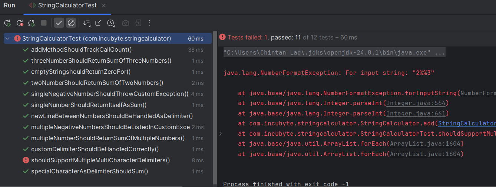         |


## 🧪 Test Case for Decimal Addition

| ID    | Test Case Description                            | Input                      | Expected Output                     | Pass ✅                                            | Fail ❌                                            |
|-------|--------------------------------------------------|----------------------------|--------------------------------------|----------------------------------------------------|----------------------------------------------------|
| TC01  | Returns 0.0 for empty input                      | ""                       | 0.0                                | 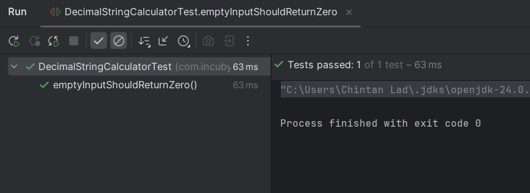           | 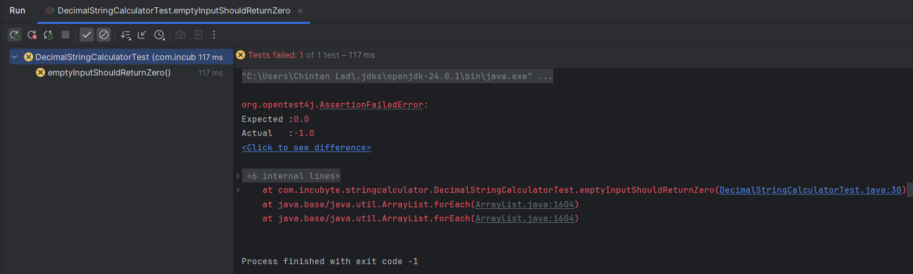          |
| TC02  | Single or multiple decimal input returns itself or sum | "2.5"                    | 2.5                                | 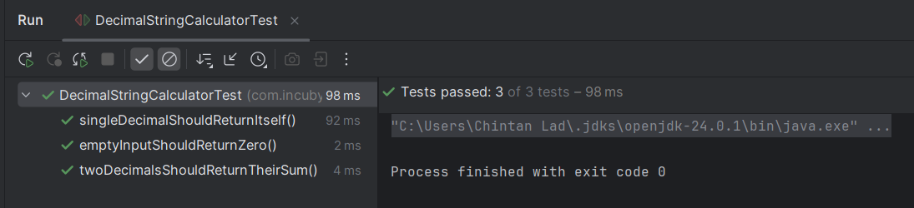           | 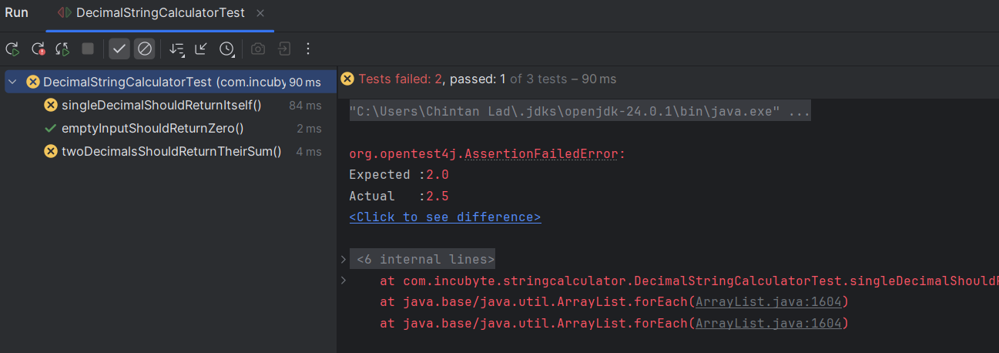          |
| TC03  | Custom delimiter with decimals is supported      | "//;\n1.5;2.5"           | 4.0                                | 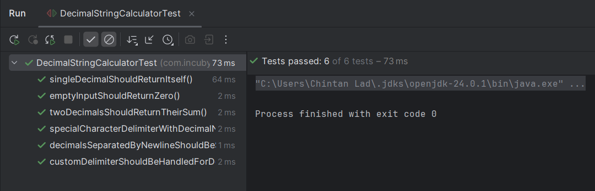           | 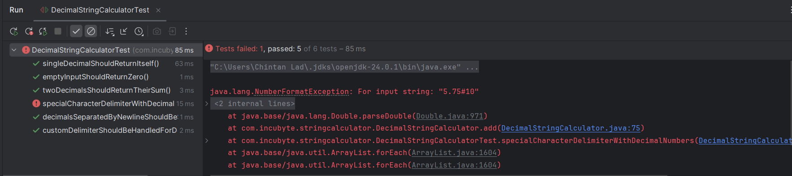          |
| TC04  | Negative decimal should throw exception          | "-2.5,3.5"               | Exception: -2.5                    | 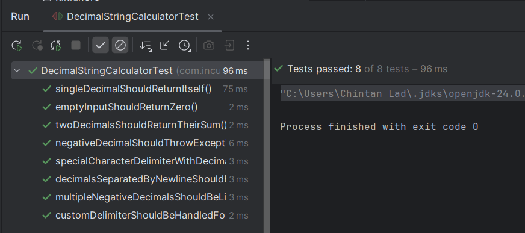           | 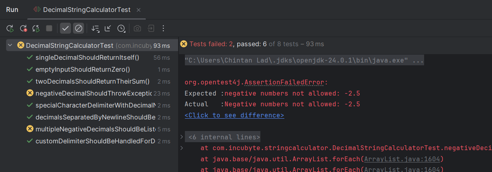          |
| TC05  | Multiple multi type delimiter                    | "2.2,1000.5"             | 2.2                                | 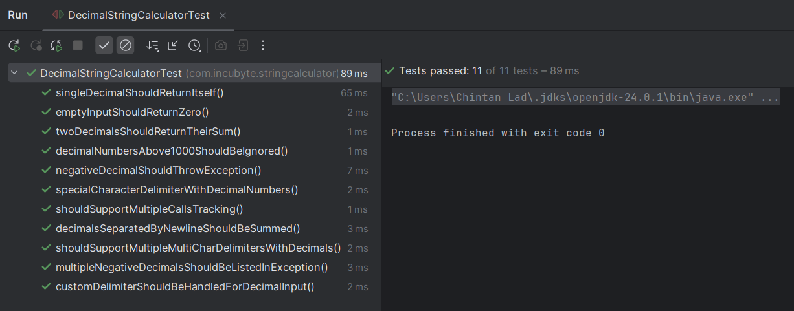           |           |
